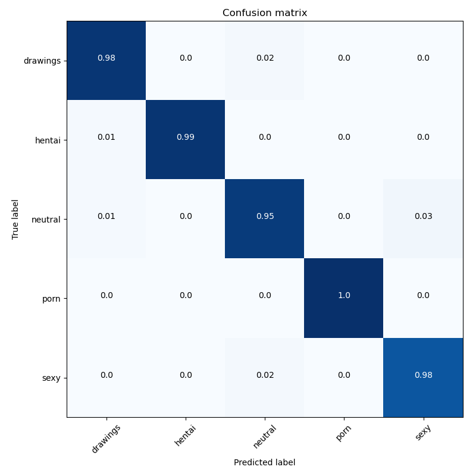

<center>

</center>

# NSFW Detection Machine Learning Model
[](#contributors)

Trained on several Gigs of data to identify:
- `drawings` - safe for work drawings (including anime)
- `hentai` - hentai and pornographic drawings
- `neutral` - safe for work neutral images
- `porn` - pornographic images, sexual acts
- `sexy` - provacative images, not pornography

This model powers [NSFW JS](https://github.com/infinitered/nsfwjs) - [More Info](https://shift.infinite.red/avoid-nightmares-nsfw-js-ab7b176978b1)

## Current Status:
97.78% Accuracy with the following confusion matrix, based on Efficientnet B3.


Note that at present, Tensorflow JS does not support conversion of the Efficientnet models.

You can review the stats of all models [here](model_data).

## Requirements:
keras (tested with versions > 2.0.0)
tensorflow >= 2.2.0

## Usage

For programmatic use of the library. 

```python
from nsfw_detector import predict
model = predict.load_model('./nsfw_mobilenet2.224x224.h5')

# Predict single image
predict.classify(model, '2.jpg')
# {'2.jpg': {'sexy': 4.3454722e-05, 'neutral': 0.00026579265, 'porn': 0.0007733492, 'hentai': 0.14751932, 'drawings': 0.85139805}}

# Predict multiple images at once
predict.classify(model, ['/Users/bedapudi/Desktop/2.jpg', '/Users/bedapudi/Desktop/6.jpg'])
# {'2.jpg': {'sexy': 4.3454795e-05, 'neutral': 0.00026579312, 'porn': 0.0007733498, 'hentai': 0.14751942, 'drawings': 0.8513979}, '6.jpg': {'drawings': 0.004214506, 'hentai': 0.013342537, 'neutral': 0.01834045, 'porn': 0.4431829, 'sexy': 0.5209196}}

# Predict for all images in a directory
predict.classify(model, '/Users/bedapudi/Desktop/')

```

If you've installed the package or use the command-line this should work, too...

```sh
# a single image
nsfw-predict --saved_model_path mobilenet_v2_140_224 --image_source test.jpg

# an image directory
nsfw-predict --saved_model_path mobilenet_v2_140_224 --image_source images

# a single image (from code/CLI)
python3 nsfw_detector/predict.py --saved_model_path mobilenet_v2_140_224 --image_source test.jpg

```


## Download
Please feel free to use this model to help your products!  

If you'd like to [say thanks for creating this, I'll take a donation for hosting costs](https://www.paypal.me/GantLaborde).

# Models
The latest models are released in a zipped format in SavedModel format, but also include a frozen graph.
Where possible, the latest model zip files will contain TensorflowJS 2-byte quantized and 1-byte quantized versions as well.

Latest models can be found on the [releases page](https://github.com/GantMan/nsfw_model/releases/).

### Original Inception v3 Model (v1.0)
* [Keras 299x299 Image Model](https://s3.amazonaws.com/nsfwdetector/nsfw.299x299.h5)
* [TensorflowJS 299x299 Image Model](https://s3.amazonaws.com/nsfwdetector/nsfwjs.zip)
* [TensorflowJS Quantized 299x299 Image Model](https://s3.amazonaws.com/nsfwdetector/min_nsfwjs.zip)
* [Tensorflow 299x299 Image Model](https://s3.amazonaws.com/nsfwdetector/nsfw.299x299.pb) - [Graph if Needed](https://github.com/tensorflow/tensorflow/tree/master/tensorflow/tools/graph_transforms#inspecting-graphs)

### Original Mobilenet v2 Model (v1.0)
* [Keras 224x224 Image Model](https://s3.amazonaws.com/ir_public/nsfwjscdn/nsfw_mobilenet2.224x224.h5)
* [TensorflowJS 224x224 Image Model](https://s3.amazonaws.com/ir_public/nsfwjscdn/TFJS_nsfw_mobilenet/tfjs_nsfw_mobilenet.zip)
* [TensorflowJS Quantized 224x224 Image Model](https://s3.amazonaws.com/ir_public/nsfwjscdn/TFJS_nsfw_mobilenet/tfjs_quant_nsfw_mobilenet.zip)
* [Tensorflow 224x224 Image Model](https://s3.amazonaws.com/ir_public/nsfwjscdn/TF_nsfw_mobilenet/nsfw_mobilenet.pb) - [Graph if Needed](https://github.com/tensorflow/tensorflow/tree/master/tensorflow/tools/graph_transforms#inspecting-graphs)
* [Tensorflow Quantized 224x224 Image Model](https://s3.amazonaws.com/ir_public/nsfwjscdn/TF_nsfw_mobilenet/quant_nsfw_mobilenet.pb) - [Graph if Needed](https://github.com/tensorflow/tensorflow/tree/master/tensorflow/tools/graph_transforms#inspecting-graphs)

## Training Folder Contents For Tensorflow 2.*
These scripts are responsible for creating the current models.
* `train_all_models.cmd` or `train_all_models.sh` - Scripts that train all current models from Tensorflow Hub modules using transfer learning.
* `convert_all_models.cmd` or `convert_all_models.sh` - Scripts that convert all current models to Tensorflow JS. Presently, Efficientnets are not supported.

Tensorflow 2.* training uses early stopping that is built-in to the training python code.
The training scripts run fine tuning twice per model, once with a higher learning rate, and a second time at a diminished learning rate to squeeze out the most accuracy.
The training process for Tensorflow 2.* also writes Tensorboard logs to the model directory and generates a confusion matrix as part of each epoch that is visible inside of Tensorboard.

While the `.cmd` and `.sh` scripts use predefined settings, the `make_nsfw_model.py` script takes a myriad of tunable parameters that control things like data augmentation,
selected optimizer and per-optimizer-settings, etc. Running `python make_nsfw_model.py --help` will yeild a list of all tunable parameters and their defaults.

_e.g._
```bash
python make_nsfw_model.py --image_dir %cd%\..\images --image_size 224 --saved_model_dir %cd%\..\trained_models\mobilenet_v2_140_224 --labels_output_file %cd%\..\trained_models\mobilenet_v2_140_224\class_labels.txt --tfhub_module https://tfhub.dev/google/imagenet/mobilenet_v2_140_224/feature_vector/4 --tflite_output_file %cd%\..\trained_models\mobilenet_v2_140_224\saved_model.tflite --train_epochs 9001 --batch_size 32 --do_fine_tuning --dropout_rate 0.0 --label_smoothing=0.0 --validation_split=0.1 --do_data_augmentation=True --use_mixed_precision=True --rmsprop_momentum=0.0
```

## Training Folder Contents For Tensorflow 1.*
* `inceptionv3_transfer/` - Folder with all the code to train the Keras based Inception v3 transfer learning model.  Includes `constants.py` for configuration, and two scripts for actual training/refinement.
* `mobilenetv2_transfer/` - Folder with all the code to train the Keras based Mobilenet v2 transfer learning model.
* `visuals.py` - The code to create the confusion matrix graphic
* `self_clense.py` - If the training data has significant inaccuracy, `self_clense` helps cross validate errors in the training data in reasonable time.   The better the model gets, the better you can use it to clean the training data manually.

_e.g._
```bash
cd tf1\training
# Start with all locked transfer of Inception v3
python inceptionv3_transfer/train_initialization.py

# Continue training on model with fine-tuning
python inceptionv3_transfer/train_fine_tune.py

# Create a confusion matrix of the model
python visuals.py
```

## Extra Info
There's no easy way to distribute the training data, but if you'd like to help with this model or train other models, get in touch with me and we can work together.

Advancements in this model power the quantized TFJS module on https://nsfwjs.com/

My twitter is [@GantLaborde](https://twitter.com/GantLaborde) - I'm a School Of AI Wizard New Orleans.  I run the twitter account [@FunMachineLearn](https://twitter.com/FunMachineLearn)

Learn more about [me](http://gantlaborde.com/) and the [company I work for](https://infinite.red/).

Special thanks to the [nsfw_data_scraper](https://github.com/alexkimxyz/nsfw_data_scrapper) for the training data.  If you're interested in a more detailed analysis of types of NSFW images, you could probably use this repo code with [this data](https://github.com/EBazarov/nsfw_data_source_urls).

If you need React Native, Elixir, AI, or Machine Learning work, check in with us at [Infinite Red](https://infinite.red/), who make all these experiments possible.  We're an amazing software consultancy worldwide!

## Contributors

Thanks goes to these wonderful people ([emoji key](https://github.com/kentcdodds/all-contributors#emoji-key)):

<!-- ALL-CONTRIBUTORS-LIST:START - Do not remove or modify this section -->
| [<br /><sub><b>Gant Laborde</b></sub>](http://gantlaborde.com/)<br />[💻](https://github.com/GantMan/nsfw_model/commits?author=GantMan "Code") [📖](https://github.com/GantMan/nsfw_model/commits?author=GantMan "Documentation") [🤔](#ideas-GantMan "Ideas, Planning, & Feedback") | [<br /><sub><b>Bedapudi Praneeth</b></sub>](http://bpraneeth.com)<br />[💻](https://github.com/GantMan/nsfw_model/commits?author=bedapudi6788 "Code") [🤔](#ideas-bedapudi6788 "Ideas, Planning, & Feedback") |
| :---: | :---: |
<!-- ALL-CONTRIBUTORS-LIST:END -->

This project follows the [all-contributors](https://github.com/kentcdodds/all-contributors) specification. Contributions of any kind welcome!

# Changes

## 1.2.1

 - Tensorflow 2.* training scripts now write Tensorboard logs that include per-epoch confusion matrices.
 
## 1.2.0

 - Tensorflow 2.* training scripts enable full configuration of data augmentation, optimizer parameters and more.

## 1.1.1

- break out numpy (nd array) function
- remove classic app run modes for argparse
- one more example in README for running
- turn down verbosity in image load via file
- fix requirements for clean system (needs PIL)

## 1.1.0

- update to tensorflow 2.1.0 and updated mobilenet-based model

## 1.0.0

- initial creation
