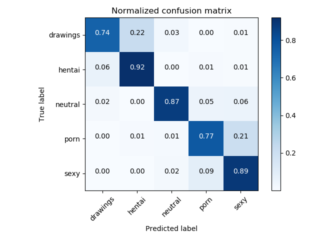

# NSFW Keras Model

Trained on 100+ Gigs of NSFW data to identify:
- `drawings` - safe for work drawings (including anime)
- `hentai` - hentai images, but also includes pornographic drawings
- `neutral` - safe for work neutral images
- `porn` - pornographic images, sexual acts
- `sexy` - sexually explicit images, but not pornography

## Current Status:
85% Accuracy with the following confusion matrix, based on Inception V3.

I'm not concerned around the `sexy` and `porn` confusions, as those are both usually NSFWish.  The drawings/hentai confusions might be more troublesome.  I'll continue trying different methods of training to approach higher accuracy.

### Thanks
Special thanks to the [nsfw_data_scraper](https://github.com/GantMan/nsfw_data_scrapper) for helping me acquire the training data.
