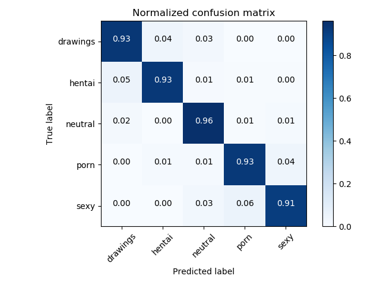

<center>

</center>

# NSFW Detection Machine Learning Model
[](#contributors)

Trained on 60+ Gigs of data to identify:
- `drawings` - safe for work drawings (including anime)
- `hentai` - hentai and pornographic drawings
- `neutral` - safe for work neutral images
- `porn` - pornographic images, sexual acts
- `sexy` - sexually explicit images, not pornography

This model powers [NSFW JS](https://github.com/infinitered/nsfwjs) - [More Info](https://shift.infinite.red/avoid-nightmares-nsfw-js-ab7b176978b1)

## Current Status:
93% Accuracy with the following confusion matrix, based on Inception V3.


Review the `_art` folder for previous incarnations of this model.

## Requirements:
keras (tested with versions > 2.0.0)

tensorflow (Not specified in setup.py)

## Usage
```python
from nsfw_detector import NSFWDetector
detector = NSFWDetector('./nsfw.299x299.h5')

# Predict single image
detector.predict('2.jpg')
# {'2.jpg': {'sexy': 4.3454722e-05, 'neutral': 0.00026579265, 'porn': 0.0007733492, 'hentai': 0.14751932, 'drawings': 0.85139805}}

# Predict multiple images at once using Keras batch prediction
detector.predict(['/Users/bedapudi/Desktop/2.jpg', '/Users/bedapudi/Desktop/6.jpg'], batch_size=32)
{'2.jpg': {'sexy': 4.3454795e-05, 'neutral': 0.00026579312, 'porn': 0.0007733498, 'hentai': 0.14751942, 'drawings': 0.8513979}, '6.jpg': {'drawings': 0.004214506, 'hentai': 0.013342537, 'neutral': 0.01834045, 'porn': 0.4431829, 'sexy': 0.5209196}}
```


## Download
Please feel free to use this model to help your products!  

If you'd like to [say thanks for creating this, I'll take a donation for hosting costs](https://www.paypal.me/GantLaborde).

* [Keras 299x299 Image Model](https://s3.amazonaws.com/nsfwdetector/nsfw.299x299.h5)
* [TensorflowJS 299x299 Image Model](https://s3.amazonaws.com/nsfwdetector/nsfwjs.zip)
* [TensorflowJS Quantized 299x299 Image Model](https://s3.amazonaws.com/nsfwdetector/min_nsfwjs.zip)
* [Tensorflow 299x299 Image Model](https://s3.amazonaws.com/nsfwdetector/nsfw.299x299.pb)
* _Contribute Here?  Convert the model!_

## Training Folders
Simple description of the scripts used to create this model:
* `inceptionv3_transfer/` - Folder with all the code to train the Keras based Inception v3 transfer learning model.  Includes `constants.py` for configuration, and two scripts for actual training/refinement.
* `visuals.py` - The code to create the confusion matrix graphic
* `self_clense.py` - If the training data has significant inaccuracy, `self_clense` helps cross validate errors in the training data in reasonable time.   The better the model gets, the better you can use it to clean the training data manually.

_e.g._
```bash
cd training
# Start with all locked transfer of Inception v3
python inceptionv3_transfer/train_initialization.py

# Continue training on model with fine-tuning
python inceptionv3_transfer/train_fine_tune.py

# Create a confusion matrix of the model
python visuals.py
```

## Extra Info
There's no easy way to distribute the training data, but if you'd like to help with this model or train other models, get in touch with me and we can work together.

Advancements in this model power the quantized TFJS module on https://nsfwjs.com/

My twitter is [@GantLaborde](https://twitter.com/GantLaborde) - I'm a School Of AI Wizard New Orleans.  I run the twitter account [@FunMachineLearn](https://twitter.com/FunMachineLearn)

Learn more about [me](http://gantlaborde.com/) and the [company I work for](https://infinite.red/).

Special thanks to the [nsfw_data_scraper](https://github.com/alexkimxyz/nsfw_data_scrapper) for the training data.  If you're interested in a more detailed analysis of types of NSFW images, you could probably use this repo code with [this data](https://github.com/EBazarov/nsfw_data_source_urls).

## Contributors

Thanks goes to these wonderful people ([emoji key](https://github.com/kentcdodds/all-contributors#emoji-key)):

<!-- ALL-CONTRIBUTORS-LIST:START - Do not remove or modify this section -->
| [<br /><sub><b>Gant Laborde</b></sub>](http://gantlaborde.com/)<br />[💻](https://github.com/GantMan/nsfw_model/commits?author=GantMan "Code") [📖](https://github.com/GantMan/nsfw_model/commits?author=GantMan "Documentation") [🤔](#ideas-GantMan "Ideas, Planning, & Feedback") | [<br /><sub><b>Bedapudi Praneeth</b></sub>](http://bpraneeth.com)<br />[💻](https://github.com/GantMan/nsfw_model/commits?author=bedapudi6788 "Code") [🤔](#ideas-bedapudi6788 "Ideas, Planning, & Feedback") |
| :---: | :---: |
<!-- ALL-CONTRIBUTORS-LIST:END -->

This project follows the [all-contributors](https://github.com/kentcdodds/all-contributors) specification. Contributions of any kind welcome!
