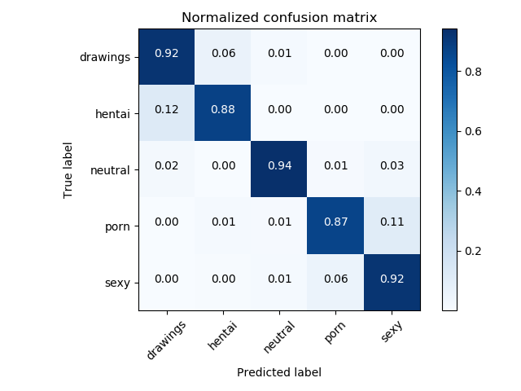

# NSFW Detection Machine Learning Model

Trained on 60+ Gigs of data to identify:
- `drawings` - safe for work drawings (including anime)
- `hentai` - hentai and pornographic drawings
- `neutral` - safe for work neutral images
- `porn` - pornographic images, sexual acts
- `sexy` - sexually explicit images, not pornography

## Current Status:
91% Accuracy with the following confusion matrix, based on Inception V3.

Review the `_art` folder for previous incarnations of this model.

## Download
Please feel free to use this model to help your products!  

If you'd like to [say thanks for creating this, I'll take a donation for hosting costs](https://www.paypal.me/GantLaborde).

* [Keras 299x299 Image Model](https://s3.amazonaws.com/nsfwdetector/nsfw.299x299.h5)
* [TensorflowJS 299x299 Image Model](https://s3.amazonaws.com/nsfwdetector/nsfwjs.zip)
* [TensorflowJS Quantized 299x299 Image Model](https://s3.amazonaws.com/nsfwdetector/min_nsfwjs.zip)
* [Tensorflow 299x299 Image Model](https://s3.amazonaws.com/nsfwdetector/nsfw.299x299.pb)
* _Contribute Here?  Convert the model!_

## Repo Contents
Simple description of the scripts used to create this model:
* `train_inception_model.py` - The code used to train the Keras based Inception V3 Transfer learned model.
* `visuals.py` - The code to create the confusion matrix graphic
* `self_clense.py` - The training data came down with some significant inaccuracy.  Self clense helped me use early iterations of the mode, to cross validate errors in the training data in reasonable time.   The better the model got, the better I could use it to clean the training data manually.  Most importantly, this also allowed me to clean the validation dataset, and get a real indication of generalized performance.

## Extra Info
There's no easy way to distribute the training data, but if you'd like to help with this model or train other models, get in touch with me and we can work together.  

My twitter is [@GantLaborde](https://twitter.com/GantLaborde) - I'm a School Of AI Wizard New Orleans.  I run the twitter account [@FunMachineLearn](https://twitter.com/FunMachineLearn)

Learn more about [me](http://gantlaborde.com/) and the [company I work for](https://infinite.red/).

Special thanks to the [nsfw_data_scraper](https://github.com/alexkimxyz/nsfw_data_scrapper) for the training data.
