# Current Model Statistics

Please note that the stats reported here are dependent on the input training and validation data. [YMMV](https://dictionary.cambridge.org/dictionary/english/ymmv).

* [Efficientnet B0](#efficientnet-b0)
* [Efficientnet B1](#efficientnet-b1)
* [Efficientnet B2](#efficientnet-b2)
* [Efficientnet B3](#efficientnet-b3)
* [Inception V3](#inception-v3)
* [Mobilenet V2 0.35](#mobilenet-v2-035)
* [Mobilenet V2 0.5](#mobilenet-v2-05)
* [Mobilenet V2 0.75](#mobilenet-v2-075)
* [Mobilenet V2 1.0](#mobilenet-v2-10)
* [Mobilenet V2 1.4](#mobilenet-v2-14)
* [NasNet A](#nasnet-a)
* [Resnet 50 V2](#resnet-50-v2)

## Efficientnet B0
* Input Dimension: 224x224x3
* Accuracy: 97.22%

### Epoch Accuracy Chart:
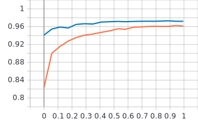

### Epoch Loss Chart:
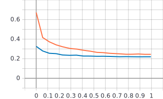

### Confusion Matrix:

## Efficientnet B1
* Input Dimension: 240x240x3
* Accuracy: 97.09%

### Epoch Accuracy Chart:
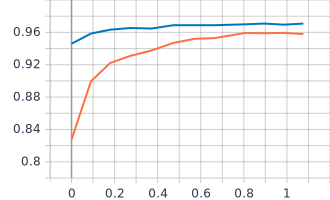

### Epoch Loss Chart:
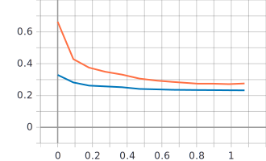

### Confusion Matrix:

## Efficientnet B2
* Input Dimension: 260x260x3
* Accuracy: 97.71%

### Epoch Accuracy Chart:
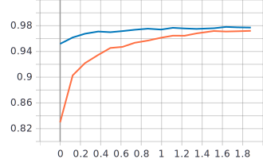

### Epoch Loss Chart:
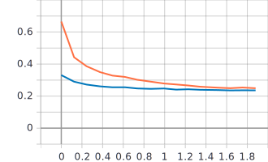

### Confusion Matrix:
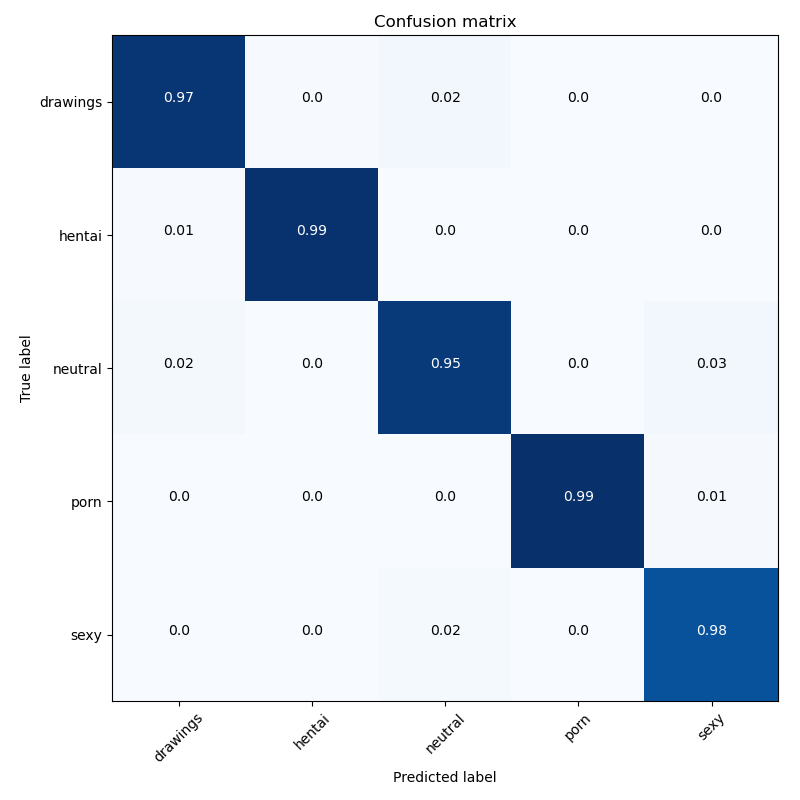

## Efficientnet B3
* Input Dimension: 300x300x3
* Accuracy: 97.78%

### Epoch Accuracy Chart:
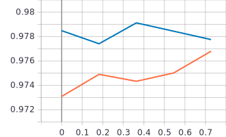

### Epoch Loss Chart:
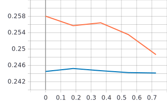

### Confusion Matrix:

## Inception V3
* Input Dimension: 224x224x3
* Accuracy: 97.39%

### Epoch Accuracy Chart:
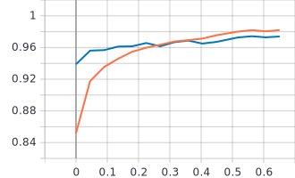

### Epoch Loss Chart:
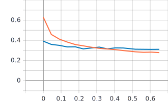

### Confusion Matrix:

## Mobilenet V2 0.35
* Input Dimension: 224x224x3
* Accuracy: 94.93%

### Epoch Accuracy Chart:
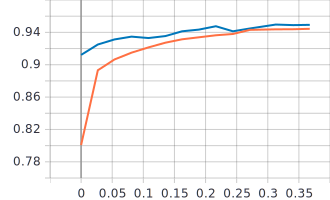

### Epoch Loss Chart:
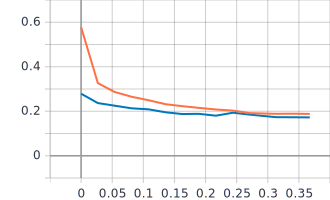

### Confusion Matrix:

## Mobilenet V2 0.5
* Input Dimension: 224x224x3
* Accuracy: 94.42%

### Epoch Accuracy Chart:
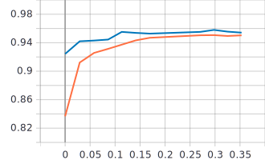

### Epoch Loss Chart:
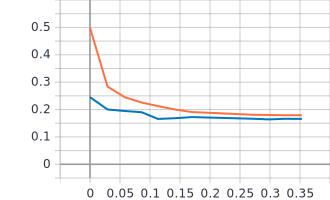

### Confusion Matrix:
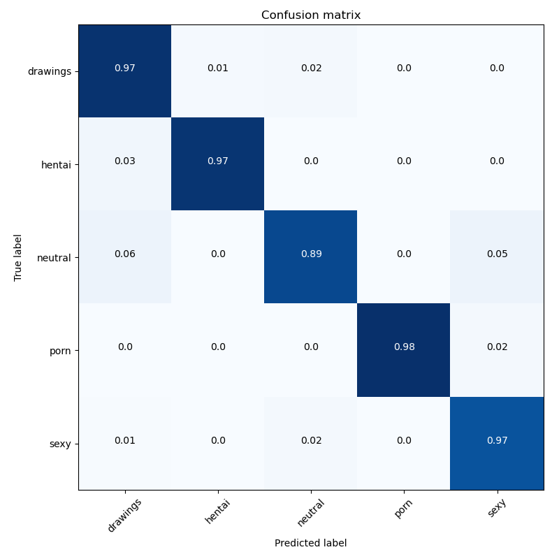

## Mobilenet V2 0.75
* Input Dimension: 224x224x3
* Accuracy: 95.97%

### Epoch Accuracy Chart:
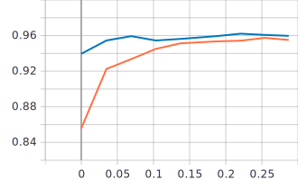

### Epoch Loss Chart:
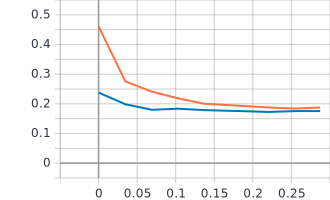

### Confusion Matrix:

## Mobilenet V2 1.0
* Input Dimension: 224x224x3
* Accuracy: 96.17%

### Epoch Accuracy Chart:
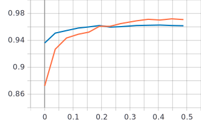

### Epoch Loss Chart:
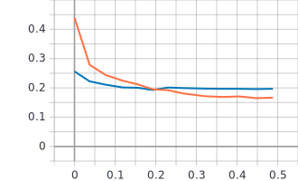

### Confusion Matrix:

## Mobilenet V2 1.4
* Input Dimension: 224x224x3
* Accuracy: 97.34%

### Epoch Accuracy Chart:
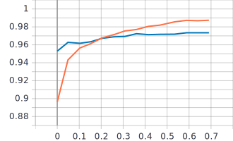

### Epoch Loss Chart:
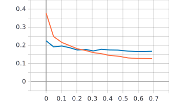

### Confusion Matrix:

## NasNet A
* Input Dimension: 224x224x3
* Accuracy: 96.63%

### Epoch Accuracy Chart:
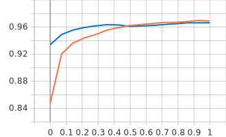

### Epoch Loss Chart:
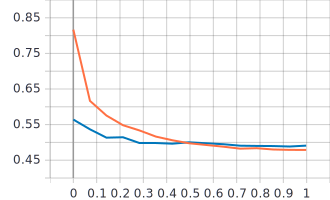

### Confusion Matrix:

## Resnet 50 V2
* Input Dimension: 224x224x3
* Accuracy: 96.64%

### Epoch Accuracy Chart:
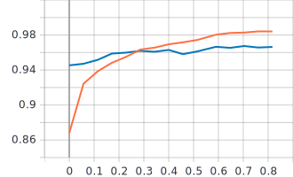

### Epoch Loss Chart:
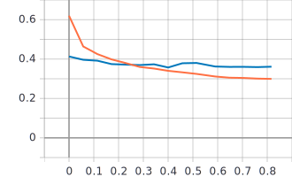

### Confusion Matrix:
